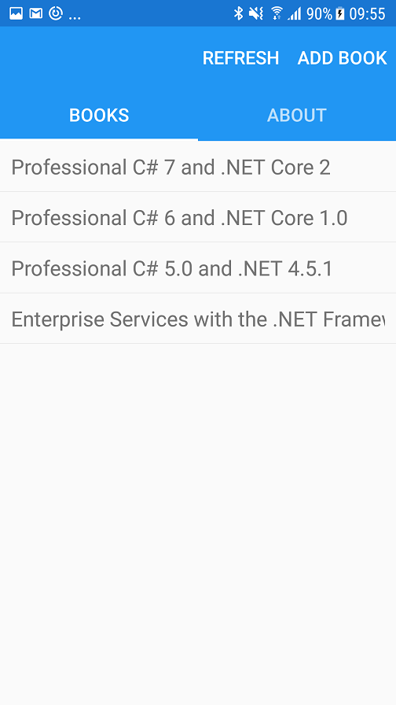
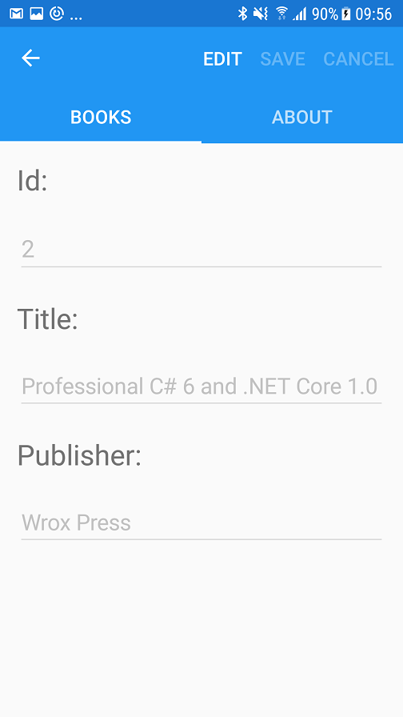

# Readme - Code Samples for Chapter 37, Xamarin.Forms

> You can build and run part of the samples if you have a Windows 10 system or a Mac. To build and run all of the samples, you need a Windows 10 system and a Mac.

The sample code for this chapter contains these projects and solutions:

* HelloAndroid (a simple Xamarin.Android project)
* HelloiOS (a simple Xamarin.iOS project for the iPhone)
* BooksAppX (Xamarin.Forms)
    * BooksAppX (shared project with views, container registrations, and services)
    * BooksAppX.Android (hosting project for Android)
    * BooksAppX.iOS (hosting project for iOS)
    * BooksAppX.UWP (hosting project for UWP)
    * BooksLib (library from the folder *PatternsXamarinShared*, view models and services)
    * Framework (library from the folder *PatternsXamarinShared*, generic view models, MVVM core classes)

Requirements:

* For the Android and iOS projects, you can use Visual Studio for Mac and a Mac
* For the UWP project, a Windows 10 system is required
* To compile the iOS projects, a Mac is required - also if you use Visual Studio on Windows

To build and run the samples with Visual Studio, please install:

* Visual Studio 2017 Update 5 with the workload **Mobile Development with .NET**.

## Figures comparing Windows, Android, and iOS

 
For code comments and issues please check [Professional C#'s GitHub Repository](https://github.com/ProfessionalCSharp/ProfessionalCSharp7)

Please check my blog [csharp.christiannagel.com](https://csharp.christiannagel.com "csharp.christiannagel.com") for additional information for topics covered in the book.

Thank you!